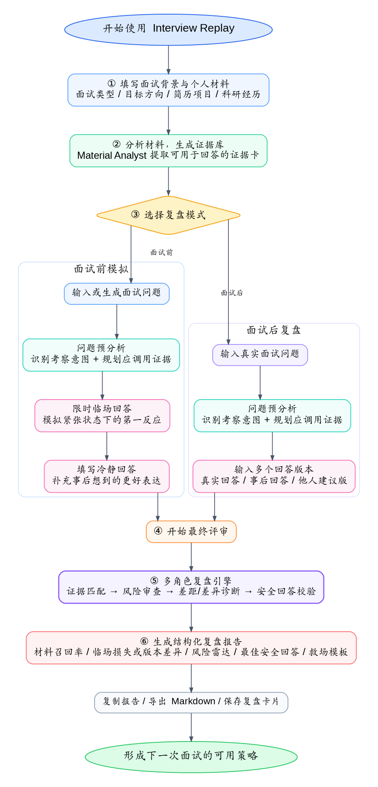

# Interview Replay｜保研面试复盘工具

> 面向保研学生的 AI 面试复盘工具：先理解用户自己的背景材料，再围绕具体面试问题分析材料调用、临场损失、回答版本差异和导师追问风险，最终生成可复用的安全回答与训练建议。

---

## 1. 项目简介

Interview Replay 是一个面向保研学生的文字版 AI 面试复盘工具。

在保研夏令营、预推免、九推复试等场景中，很多学生面试结束后会反复后悔：

- “我刚才是不是应该换一种说法？”
- “老师追问是不是说明我答得不好？”
- “我明明有项目经历，为什么现场没讲出来？”
- “我被拒了，但不知道到底哪里出了问题。”

市面上已有很多 AI 面试工具聚焦于模拟面试、连续追问、题库练习或语音视频表达训练。但如果缺少针对个人材料和具体回答的反馈机制，学生很难把这些模糊感受转化成可执行的改进动作。最终，这次面试带来的宝贵经验也就随着懊悔的情绪被抛之脑后了。

因此，本项目选择聚焦“复盘”。核心问题是：

> 围绕一道具体面试问题，分析我为什么没答好、漏掉了哪些材料、哪些表达有追问风险，以及下一次应该怎么答得更得体。

因此，Interview Replay 希望把学生面试后的模糊后悔转化为结构化诊断和可执行改进，帮助同学们快速调整表达策略，获得进步。

---

## 2. 核心功能

### 2.1 材料分析

材料分析是整个系统的起点。

用户先在首页填写或上传自己的背景材料，例如：

- 简历亮点；
- 科研经历；
- 项目经历；
- 课程或竞赛经历；
- 个人陈述；
- 目标方向或目标院校信息。

系统会先运行材料分析器，将这些材料整理成“材料证据库”。每一张证据卡会包含：

- 证据标题；
- 证据类型，例如项目、科研、课程、竞赛、个人陈述等；
- 可支撑的面试问题；
- 体现的能力；
- 可能被导师追问的点；
- 使用这段材料时的风险；
- 建议表达方式；
- 仍然缺失的信息。

材料分析的价值是：系统不是凭空润色回答，而是先理解用户“手里有什么材料”，再判断一道题应该调用哪些经历作为支撑。

例如，用户输入项目经历后，系统可能提取出：

```text
证据卡：大模型论文中译英 TeX 编辑器项目
可支撑问题：项目介绍、科研兴趣、个人贡献、工程能力
体现能力：Prompt 设计、前后端开发、科研写作可靠性
追问风险：你具体负责模型能力，还是负责交互和工程实现？
建议表达：我主要负责 Prompt 模板、结构化输出约束和前端交互流程，不涉及模型参数训练。
```

后续面试前模拟和面试后复盘都会复用这套材料证据库。

---

### 2.2 面试前模拟

面试前模拟模式用于帮助用户提前发现临场表达问题。

用户可以输入：

- 面试问题（或者系统根据材料）；
- 限时临场回答（模拟真实场景）；
- 冷静回答。

系统会分析：

- 这道题的真实考察意图；
- 临场回答相比冷静回答损失了什么；
- 用户本来有哪些材料可以使用；
- 回答中有哪些导师追问风险；
- 下一次紧张时可以使用什么救场模板。

典型输出包括：

- 问题真实意图；
- 材料召回率；
- 临场损失分析；
- 风险雷达；
- 安全回答；
- 下次救场模板。

---

### 2.3 面试后复盘

面试后复盘模式用于复盘真实面试中的某一道问题。

用户可以输入：

- 真实面试问题；
- 真实回答；
- 事后想到的回答；
- 学长 / 同学 / AI 建议等其他版本

系统会比较多个回答版本：

- 哪个回答更稳；
- 哪个回答更空泛；
- 哪个回答虽然高级但有追问风险；
- 哪些内容应该融合；
- 最终应该如何形成一个真实、具体、可承接的回答。

典型输出包括：

- 问题意图识别；
- 多版本回答排名；
- 各版本优缺点；
- 逐句诊断；
- 导师追问风险；
- 安全回答；
- 可迁移回答公式；
- 下一次面试清单。

---

## 3. 产品亮点

### 3.1 从“模拟面试”转向“复盘面试”

本项目没有把核心放在连续追问或题库练习上，而是聚焦面试前后的回答复盘。

产品希望解决的问题是：

> 用户答完之后，能不能知道自己哪里没答好，以及下一次怎么改？

---

### 3.2 材料召回率

系统会结合用户提供的个人材料，判断这道题本来应该使用哪些经历作为支撑，以及用户实际回答中使用了哪些材料。

例如：

```text
材料召回率：0 / 3

你本来可以使用：
1. 大模型论文中译英 TeX 编辑器项目；
2. Prompt 设计经历；
3. 科研写作中的术语一致性问题。

但临场回答没有调用任何一个，因此回答显得像模板表达。
```

---

### 3.3 临场损失分析

很多学生并不是不会答，而是临场紧张时漏掉关键信息。

系统会分析用户在临场回答中丢失了哪些内容，例如：

- 证据损失；
- 结构损失；
- 深度损失；
- 匹配损失；
- 个人贡献边界损失。

---

### 3.4 多版本回答对比

面试后复盘模式支持输入多个回答版本，并由系统进行对比。

这些版本可以是：

- 真实面试现场回答；
- 面试后自己重新组织的回答；
- 同学或学长建议版本；
- AI 改写版本；
- 其他备选表达。

系统不会简单判断“哪个更好听”，而是从保研面试可承接性的角度比较：

- 哪个版本更具体；
- 哪个版本更能调用个人材料；
- 哪个版本贡献边界更清楚；
- 哪个版本更容易被导师追问；
- 哪些句子应该保留；
- 哪些表达应该避免；
- 多个版本中哪些内容可以融合成更稳的回答。

例如：

```text
版本 A：真实回答
优点：表达自然，和现场问题贴近。
问题：没有调用项目证据，贡献边界不清。

版本 B：事后修改版
优点：补充了项目背景和技术细节。
问题：表述略显包装，可能被追问“你具体做了什么”。

融合建议：
保留版本 A 的自然口吻，吸收版本 B 中关于 Prompt 模板和输出约束的具体证据，同时降低“模型优化”这类容易夸大的说法。
```

这一功能的价值是帮助用户从多个答案中提炼出“可复用表达策略”，而不是只得到一次性的润色结果。

---

### 3.5 导师追问风险

系统会站在保研导师视角，判断回答中哪些表述可能被追问。

例如：

```text
风险表述：我主要负责模型优化。

导师可能追问：
你优化的是模型参数、Prompt，还是推理流程？

安全回应：
我这里的优化主要指 Prompt 模板、输出格式约束和交互流程优化，不涉及模型参数训练。
```

---


## 4. 技术栈说明

本项目采用轻量 Web 应用架构，便于本地运行、GitHub 提交、云服务器部署和 Demo 展示。

### 4.1 前端

- Next.js 16 App Router；
- React 19；
- TypeScript；
- Tailwind CSS 4；
- 浏览器 localStorage，用于保存材料上下文、上传文件文本、材料预分析结果和问题预分析结果。

### 4.2 后端

- Next.js API Routes；
- Node.js Runtime；
- 服务端环境变量读取 LLM Key；
- 服务端输入校验；
- 服务端结构化报告生成；
- 文件解析接口，支持将上传材料转换为文本。

### 4.3 AI 能力

- 通用 LLM API 调用；
- 支持 `LLM_API_KEY` / `LLM_BASE_URL` / `LLM_MODEL` 这类通用变量；
- 兼容 DeepSeek、智谱等供应商变量名；
- 结构化 Prompt；
- JSON 输出解析与兜底 normalizer；
- 轻量多角色诊断链。

当前多角色链路包括：

- Material Analyst：材料分析器；
- Question Intent Analyst：问题意图分析器；
- Evidence Planner：证据规划器；
- Evidence Mapper：证据匹配器；
- Skeptical Professor：导师风险审查员；
- Gap Diagnoser：面试前临场差距诊断器；
- Diff Analyst：面试后多版本差异诊断器；
- Answer Synthesizer：安全回答生成器；
- Verifier / Critic：最终回答校验员；
- Training Planner：训练规划器；
- Report Composer：报告聚合器。

### 4.4 测试与工程

- TypeScript 类型检查；
- ESLint；
- `tests/` 中包含后端/API/质量样例相关测试脚本；
- `package-lock.json` 固定依赖版本，便于服务器复现安装。

### 4.5 部署

可部署在：

- 本地 Node.js 环境；
- 云服务器；
- 支持 Node.js / Next.js 的平台。

生产运行方式使用：

```bash
npm run build
npm start
```

云服务器常驻进程可使用 PM2。

---

## 5. 运行方式

可以通过访问 [Interview Replay](http://8.141.96.210:3000/) 来进行体验，也可以遵照下述步骤在本地或服务器上运行项目。

### 5.1 克隆项目


> 注意：实际 Web 项目位于 `ai-interview-replay/` 子目录。所有安装、开发、构建和启动命令都应在该目录下执行。

```bash
git clone <your-repo-url>
cd <your-project-folder>/ai-interview-replay
```

如果已经在仓库根目录：

```bash
cd ai-interview-replay
```

### 5.2 安装依赖

项目使用 npm 和 `package-lock.json` 固定依赖版本：

```bash
npm install
```

不建议混用 pnpm / yarn，避免锁文件和服务器安装结果不一致。

### 5.3 配置环境变量

复制环境变量模板：

```bash
cp .env.example .env.local
```

Windows PowerShell 可使用：

```powershell
Copy-Item .env.example .env.local
```

然后在 `.env.local` 中填写API模型（本项目使用 DeepSeek API）。

DEEPSEEK_API_KEY=your_deepseek_key

### 5.4 本地开发

```bash
npm run dev
```

启动后访问：

```text
http://localhost:3000
```

如果需要指定端口：

```bash
npm run dev -- -p 3001
```

### 5.5 构建项目

```bash
npm run build
```

### 5.6 生产环境启动

```bash
npm start
```

默认访问端口为 3000。生产服务器如需指定端口，可设置 `PORT`：

```bash
PORT=3000 npm start
```

Windows PowerShell：

```powershell
$env:PORT=3000
npm start
```

### 5.7 PM2 部署示例

如果部署在云服务器上，可以使用 PM2 保持服务运行：

```bash
pm2 start npm --name interview-replay -- start
pm2 logs interview-replay
pm2 restart interview-replay
pm2 save
```

服务器更新代码后：

```bash
git pull
npm install
npm run build
pm2 restart interview-replay
```

---

## 6. 使用说明

流程图如下：



### 6.1 面试前模拟流程

1. 进入首页；
2. 填写面试类型、目标方向、目标院校；
3. 输入或上传背景材料；
4. 点击“分析材料”，生成材料证据库；
5. 进入“面试前模拟”；
6. 输入或生成一道面试问题；
7. 在临场状态下写出第一版回答；
8. 再冷静思考，写出第二版回答；
9. 点击生成复盘报告；
10. 查看材料召回率、临场损失、风险雷达和救场模板。

---

### 6.2 面试后复盘流程

1. 进入首页；
2. 填写面试类型、目标方向、目标院校；
3. 输入或上传背景材料；
4. 点击“分析材料”，生成材料证据库；
5. 进入“面试后复盘”；
6. 输入真实面试问题；
7. 添加至少两个回答版本；
8. 点击生成复盘报告；
9. 查看回答排名、版本差异、逐句诊断、导师追问风险和安全回答。

---

## 7. 功能边界与取舍

本项目在比赛 Demo 阶段刻意没有做以下功能：

### 7.1 连续追问

市场和通用 ChatGPT 都很容易做到，差异化不强；本项目更关注答完后的复盘与改进。

### 7.2 题库

通用题库针对性弱，且市场已有很多；本项目聚焦用户自己的材料和具体回答。

### 7.3 音视频

实现复杂、容易分散精力；本版本用文字模拟“临场回答 vs 冷静回答”的差距。

### 7.4 复杂导师 / 院校知识库

本版本不依赖外部导师数据库，而是基于用户主动提供的背景材料进行复盘分析。

### 7.5 账号和数据库

本版本不做账号系统和数据库。用户材料、预分析结果和问题规划主要保存在浏览器本地 localStorage 中，适合本地 Demo 和轻量部署。

---

## 8. 项目结构

实际项目位于 `ai-interview-replay/` 子目录。

```text
ai-interview-replay/
├── AGENTS_for_this.md
├── GUIDES/
├── README.md
├── .env.example
├── eslint.config.mjs
├── next.config.ts
├── package.json
├── package-lock.json
├── postcss.config.mjs
├── tsconfig.json
├── tests/
└── src/
    ├── app/
    ├── components/
    ├── features/
    ├── lib/
    └── types/
```

### 8.1 根目录文件

```text
ai-interview-replay/package.json
```

定义 npm 脚本、运行时依赖和开发依赖。

```text
ai-interview-replay/package-lock.json
```

锁定依赖版本，保证服务器安装结果可复现。

```text
ai-interview-replay/.env.example
```

环境变量模板，只包含占位符，不包含真实 API Key。

```text
ai-interview-replay/README.md
```

子项目正式 README，说明本地运行、构建和部署方式。

```text
ai-interview-replay/GUIDES/
```

规划和说明文档目录，包括产品方案、升级计划、质量优化计划、前端优化计划、最终架构说明和操作流程说明。

```text
ai-interview-replay/tests/
```

测试脚本和质量样例数据，包括后端/API 测试脚本、函数测试和典型问题 fixture。

---

### 8.2 `src/app/`

Next.js App Router 页面和 API 路由。

```text
src/app/page.tsx
```

首页材料工作台：填写面试背景、输入/上传材料、分析材料、选择模式。

```text
src/app/pre/page.tsx
```

面试前模拟页面：问题输入、临场回答、冷静回答、最终复盘。

```text
src/app/post/page.tsx
```

面试后复盘页面：真实问题输入、多版本回答对比、最终复盘。

```text
src/app/layout.tsx
src/app/globals.css
```

全局布局和样式。

```text
src/app/api/agents/material/route.ts
```

材料预分析 API，运行材料分析器，生成材料证据库。

```text
src/app/api/agents/question-plan/route.ts
```

问题预分析 API，运行问题意图分析和证据规划。

```text
src/app/api/replay/pre/route.ts
```

面试前复盘 API，运行面试前多 Agent 诊断链。

```text
src/app/api/replay/post/route.ts
```

面试后复盘 API，运行面试后多 Agent 诊断链。

```text
src/app/api/questions/route.ts
```

练习问题生成 API，根据材料和方向生成面试题。

```text
src/app/api/parse-file/route.ts
```

文件解析 API，用于解析上传材料文本。

---

### 8.3 `src/components/`

通用 UI 组件目录。

主要组件包括：

- `mode-card.tsx`：首页模式选择卡片；
- `material-file-manager.tsx`：材料文件上传和标签管理；
- `material-readiness-panel.tsx`：材料准备提示；
- `use-guide-panel.tsx`：首页使用流程说明；
- `step-guide.tsx`：面试前/后页面步骤引导；
- `agent-pipeline.tsx`：侧边栏 Agent 状态流程；
- `agent-trace-panel.tsx`：报告中的真实 Agent trace；
- `report-section.tsx`：报告折叠区块；
- `report-reading-guide.tsx`：报告阅读顺序提示；
- `safe-answer-panel.tsx`：安全回答展示；
- `risk-radar-panel.tsx`：风险雷达展示；
- `material-recall-panel.tsx`：材料召回率展示；
- `evidence-card-list.tsx`：材料证据卡展示；
- `evidence-claim-list.tsx`：证据依据展示；
- `professor-pressure-test-list.tsx`：导师压力测试展示；
- `answer-verification-panel.tsx`：回答安全校验展示；
- `markdown-export-button.tsx`：Markdown 导出按钮；
- `copy-button.tsx`：一键复制按钮；
- `loading-state.tsx`：加载状态；
- `error-panel.tsx`：错误提示。

---

### 8.4 `src/features/`

按业务模式拆分的前端功能模块。

```text
src/features/pre-replay/
```

面试前模拟功能：

- `pre-replay-form.tsx`：面试前表单、限时临场回答、冷静回答；
- `pre-replay-result.tsx`：面试前报告展示；
- `pre-replay-client.ts`：面试前 API 请求封装；
- `use-pre-answer-timer.ts`：临场作答计时逻辑。

```text
src/features/post-replay/
```

面试后复盘功能：

- `post-replay-form.tsx`：真实问题和多回答版本表单；
- `post-replay-result.tsx`：面试后报告展示；
- `post-replay-client.ts`：面试后 API 请求封装；
- `use-answer-versions.ts`：回答版本增删改逻辑。

---

### 8.5 `src/lib/`

业务逻辑、AI 调用、Agent 编排和工具函数目录。

```text
src/lib/agents/
```

多 Agent 诊断链核心实现：

- `material-agent.ts`：材料分析；
- `intent-agent.ts`：问题意图分析；
- `evidence-planner-agent.ts`：证据规划；
- `evidence-agent.ts`：证据匹配和材料召回；
- `professor-agent.ts`：导师风险审查；
- `gap-agent.ts`：面试前临场差距诊断；
- `diff-agent.ts`：面试后多版本差异诊断；
- `synthesizer-agent.ts`：安全回答生成；
- `verifier-agent.ts`：最终回答校验；
- `training-agent.ts`：训练建议和复盘卡片；
- `runner.ts`：串并联编排各 Agent；
- `composer.ts`：聚合最终报告；
- `quality-normalizers.ts`：质量优化字段兜底；
- `fingerprint.ts`：材料/问题指纹，用于预分析复用；
- `json.ts`：模型 JSON 输出解析；
- `types.ts`：Agent 内部输入输出类型。

```text
src/lib/ai/
```

AI 调用相关逻辑：

- `provider.ts`：LLM 请求封装；
- `prompts.ts`：提示词；
- `report-normalizer.ts`：报告字段标准化。

其他工具：

- `interview-context.ts`：浏览器上下文和 localStorage 管理；
- `schemas.ts`：API 请求校验；
- `env.ts`：服务端环境变量读取；
- `copy-format.ts`：复制文本格式化；
- `markdown-export.ts`：Markdown 导出格式化；
- `filename.ts`：导出文件名处理；
- `demo-data.ts`：前端示例材料。

---

### 8.6 `src/types/`

统一类型定义目录。

```text
src/types/replay.ts
```

定义复盘请求、复盘响应、报告结构、材料证据卡、风险项、回答校验、Agent trace 等核心类型。

---
